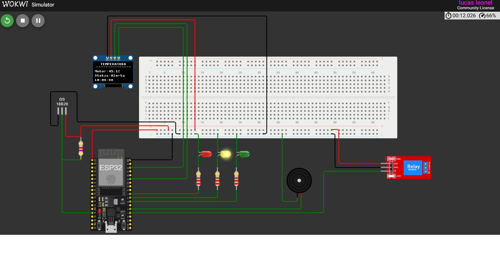
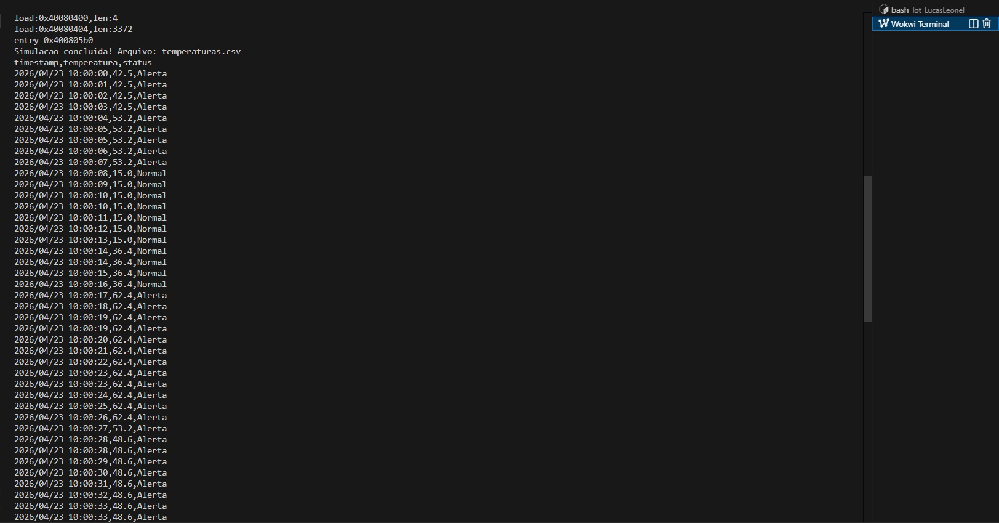

### 👤 Identificação do Candidato

- **Nome: Lucas Vinicius Santos Leonel**  
- **GitHub: [github](https://github.com/lucasvinisan)**  


**SIMULAÇÂO VSCODE**



**SAÍDA print do Arquivo CSV**



## 1️⃣ Visão Geral da Solução

`Objetivo:`

 Simular o sistema de temperatura de um motor e gerar todas as temperaturas em um intervalo (para, posteriormente, ser usado na implemetação de algoritmos preditivos). 

`O que o Sistema Faz: ` 

 No curso de Análise Preditiva de Dados de Sensores na (Unidade 1: Modelos Preditivos: Regressão e Séries Temporais) foi descrito uma implementação de uma série temporal, onde foi utilizado uma base de dados simulando temperaturas de um sensor. Diante disso, a minha solução foi criar um sistema de medição de temperatura de um motor, verificando a temperatura em determinado horários e as classificando em escalas de (Normal, Alerta e Perigo) para simular um cenário real. Ao final da simulação, é gerado um arquivo CSV com todas as temperaturas e os horários observados na simulação. 


`Interação do Usuário com Sistema:`

 No inicio da simulção o usuário tem a posibilidade de interagir com  o sistema clicando no sensor de temperatura e modifando ela de acordo com a barra de temperatura.  

 **Realizando Modificações no Projeto**:

 Se o usuário desejar realizar alguma modifcação, então ele deve seguir os seguintes passos: 

 * Passo 1: 
   ```
   touch /workspaces/Iot_LucasLeonel/src/main.py && python watch.py  (IoT_LucasLeonel -> nome do Diretorio)
   ```
   Ele vai ficar rodando em um terminal separado. Para parar o watch.py é só apertar Ctrl + C no terminal que ele está rodando.
   
 * Passo 2: 
 
   ```
   FAz alguma modifcação no aqruivo src/main.py 
   ```

 * Passo 3:

   ```
   Salvar com Ctrl + S.  
   ```

 * Passo 4: 

   ```
   Mudança detectada: ./src/main.py
   fs.bin gerado com sucesso! 
   ```
 A Mensagem de modificação que aparecerá no terminal 
 Ele já vai inserir as novas modificações no arquivo fs.bin
  
* Passso 5: 

   ***No Wokwi, clicar em ■ Stop e depois ▶ Play para carregar o novo fs.bin***
---

## 2️⃣ Arquitetura do Sistema Embarcado

- Fluxo principal do programa (`main.py`)  
```
inicializar()
     ↓
inicializar_csv()
     ↓
loop principal [while cont <= 100] (Pegar apenas 100 temperaturas) 
     ↓
ler_temperatura() → classificar_status() → obter_timestamp()
     ↓
atualizar_display() e o controlar_atuadores()
     ↓
salvar_buffer() → (a cada 10 leituras das temperaturas são gravas no CSV)
     ↓
finalizar()
```

A estrutura dos Estados: 
O sistema desenvolvido atua em três estados com base em temperaturas que são lidas pelo sensor de temperatura. 

- Estrutura de estados, loops ou temporizações  

| ESTADO  | INTERVALO |AÇÕES |
| ------------- |:-------------:|:-------------:|
| Normal      | 0°C - 40°C     |LED VERDE + OLED|
| ALERTA      | 41°C - 70°C     | LED AMARELO + OLED|
| PERIGO      | > 70     | LED VERMELHO + BUZZER + ROLÉ + OLED |

- Interação dos Componentes  

A Interação realizada entre os componentes: a cada iteração o sensor fornece a temperatura, que define o estado, que por sua vez controla simultaneamente o display OLED, os LEDs, o buzzer e o relé. 

---

## 3️⃣ Componentes Utilizados na Simulação

Os principais componentes definidos no `diagram.json`:

| COMPONENNTES  | IDENTIFICADOR | FUNÇÂO |
| ------------- |:-------------:| :-------------:|
| ESP32 DevKit C v4      | `esp`     |Microcontrolador principal, executa o MicroPython|
| DS18B20    | `temp1`     |Sensor de temperatura digital via protocolo OneWire|
| Display OLED SSD1306    | `oled1`     |Exibe temperatura, status e horário em tempo real|
| LED vermelho    | `led1`     |Indica status PERIGO (>70°C)|
| LED amarelo    | `led2`     |Indica status Alerta (41–70°C)|
| LED verde   | `led3`     |Indica status Normal (0–40°C)|
| Buzzer   | `bz1`     |Emite alerta sonoro em caso de PERIGO|
| Módulo Relé   | `relay1`     |Simula desligamento do motor em caso de PERIGO|
| Resistores 220Ω   | `r1,r2,r3`     |Limitadores de corrente dos LEDs|
| Resistor 4700Ω   | `r4`     |Pull-up obrigatório para o barramento OneWire do DS18B20|


---

## 4️⃣ Decisões Técnicas Relevantes

 Tomadas de decisões durante o desenvolvimento:

- **Organização**: o código foi dividido em funções (`ler_temperatura`, `classificar_status`, `controlar_atuadores`, ...), facilitando manutenção e leitura.

- **Constantes**: `SALVAR_A_CADA` e `ARQUIVO_CSV` foram definidos no topo do arquivo para centralizar configurações.

- **Buffer de escrita**: as leituras são acumuladas em memória e gravadas no CSV a cada 10 registros, reduzindo operações de escrita no sistema de arquivos.

- **CSV**: o formato CSV com cabeçalho `timestamp`,`temperatura`,`status` foi escolhido para permitir análise posterior com ferramentas como pandas, Excel ou qualquer biblioteca de série temporal.

- **Resistor pull-up**: Foi utilizado um resistor de pull-up na linha de dados do DS18B20, com o valor de 4.7kΩ.

- **Gerando o Arquivo fs.bin**: o Wokwi requer um binário LittleFS `fs.bin` para carregar os arquivos .py na simulação. Como o `mklittlefs` não estava disponível no Dev Container, foi utilizada a biblioteca `littlefs-python` para gerar o binário diretamente via Python, adaptando o watch.py para gerar o fs.bin automaticamente a cada alteração nos arquivos fonte.


- **Modificações Realizadas no Dev Container**: 


Instalação da biblioteca `littlefs-python` para geração do `fs.bin`:
   
   ```
      pip install littlefs-python --break-system-packages
   ```

Instalação da biblioteca `watchdog` para monitoramento automático da pasta `src/`:   
   
   ```
      pip install watchdog --break-system-packages
   ```

- **Modificações Realizadas no wokwi.toml**:

 Esse modificação foi necessária, para definidir o sistema de arquivos da simulação, indicando ao Wokwi que deve montar um volume `LittleFS` a partir do arquivo `binaries/fs.bin`
   
   ```
      [fs]
      type = "littlefs"
      image = "binaries/fs.bin"
   ```

 **Arquivo ssd1306.py adicionado no diretório /src**:

  É a biblioteca do display OLED SSD1306 para MicroPython. Ela fornece as funções para controlar o display, como fill(), text() e show(), que são usadas no main.py para exibir as informações na tela

---

## 5️⃣ Resultados Obtidos

Descreva o comportamento final do sistema:

**O que funciona corretamente:**

* Leitura contínua da temperatura via sensor DS18B20 ✅

* `Classificação automática em 3 estados` (Normal, Alerta e PERIGO) ✅

* `Atualização em tempo real` do display OLED com temperatura, status e horário ✅

*  Acionamento correto dos `LEDs` de acordo com o estado ✅

*  Disparo do `buzzer` e `relé` exclusivamente no estado PERIGO ✅

*  `Registro das leituras` em arquivo CSV com timestamp do RTC ✅

*   `Geração automática do fs.bin` ✅

**Requisitos atendidos:**

* Sistema embarcado funcional simulado no Wokwi ✅

* Persistência de dados em CSV para análise posterior ✅

* Código organizado em funções com responsabilidade única ✅

* Interação entre múltiplos componentes de hardware ✅

**Resultado observado na simulação:**

* O display OLED exibe corretamente a temperatura, status e horário a cada iteração

* Os LEDs alternam conforme a temperatura é modificada pela barra do sensor no Wokwi

* O buzzer e o relé são acionados quando a temperatura ultrapassa 70°C

* O terminal exibe as leituras no formato data | horario | Status (Normal | ALERTA | PERIGO)

* Ao final das 100 iterações, o CSV é impresso no terminal e o display exibe "Simulacao Concluida!"

---

## 6️⃣ Comentários Adicionais

- **Dificuldades**

O projeto foi desafiador, pois tive pouco contato prévio com o desenvolvimento de sistemas embarcados. A primeira barreira, sem dúvida, foi configurar o ambiente no VS Code para que a simulação ocorresse corretamente; foram necessárias algumas horas de dedicação até superar essa etapa. Durante a construção da solução, surgiram desafios de implementação, como a configuração de periféricos e a integração de bibliotecas auxiliares para dispositivos como o display OLED. Por fim, desenvolver este projeto foi uma excelente experiência prática que contribuirá positivamente para a minha formação profissional. 

- **Limitações da solução** 

A data precisa ser definida manualmente, uma vez que a integração via Wi-Fi não foi implementada nesta etapa. O arquivo gerado contém 100 observações, um volume definido apenas para demonstrar a funcionalidade da solução. Como melhoria futura, os dados poderiam ser enviados para um repositório na nuvem, o que tornaria o projeto mais robusto. 


- **Melhorias que seriam feitas com mais tempo** 

     Código:

     - Substituir o loop fixo de 100 iterações por um loop infinito com `KeyboardInterrupt`
     
     - Adicionar média móvel das ultimas leituras realizadas 

     WIFI:

     - Enviar dados via Wi-Fi para um servidor `HTTP`
     
     - Enviar alertas via e-mail quando atingir estado `PERIGO`


- **Principais Aprendizados:** 

O principal ganho deste projeto foi o conhecimento sobre sistemas embarcados, adquirido tanto nos cursos da primeira etapa do PNAAT quanto na implementação prática desta solução. Sendo essa uma área extremamente interessante e com diversas aplicabilidades. Desenvolver este projeto, com toda a certeza, contribuiu de forma considerável para a minha bagagem técnica e para o meu desenvolvimento profissional.
